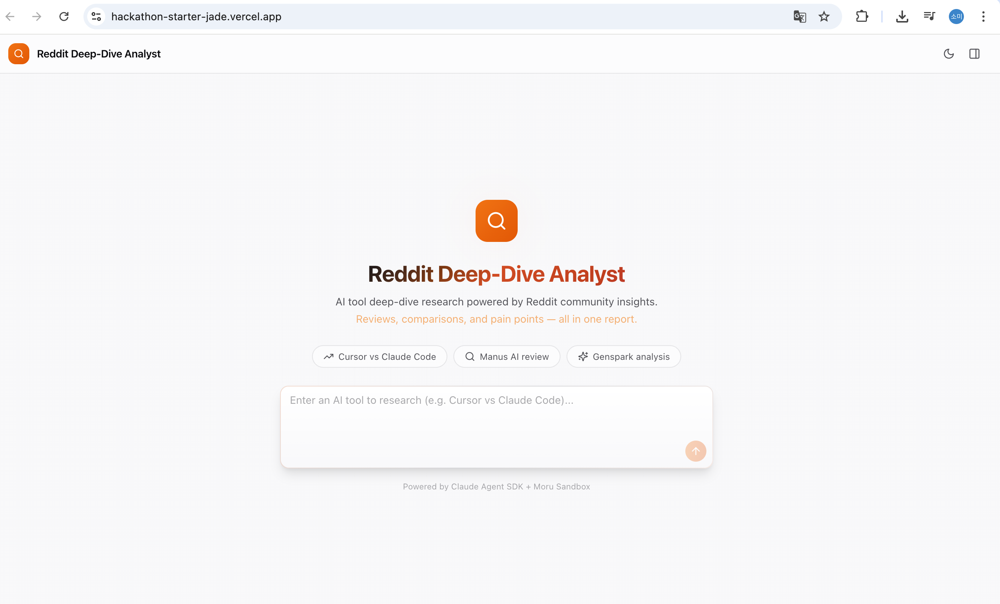
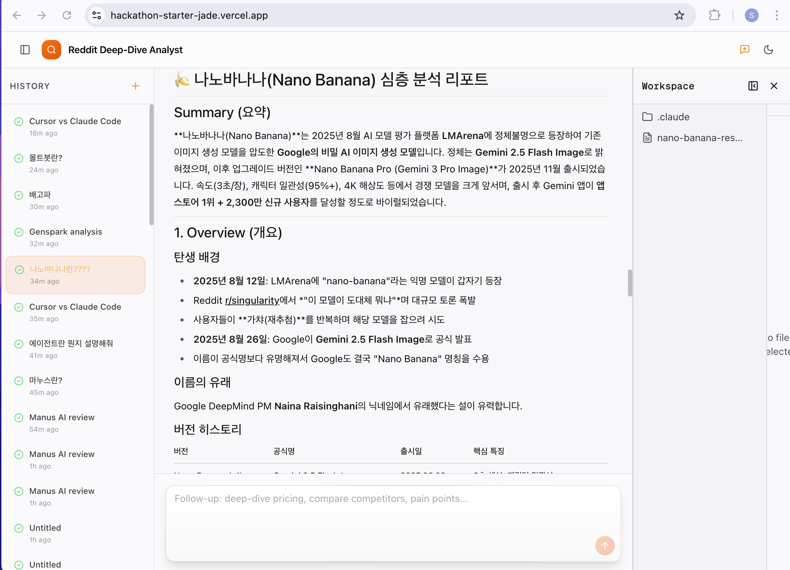
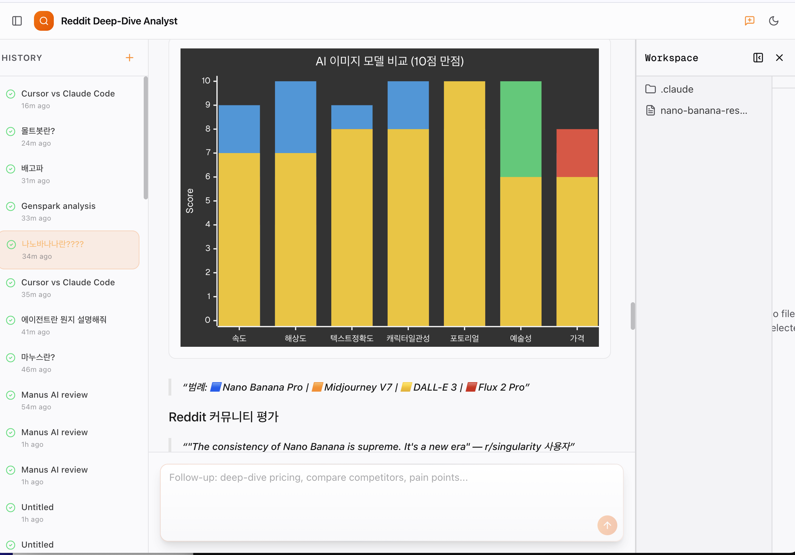
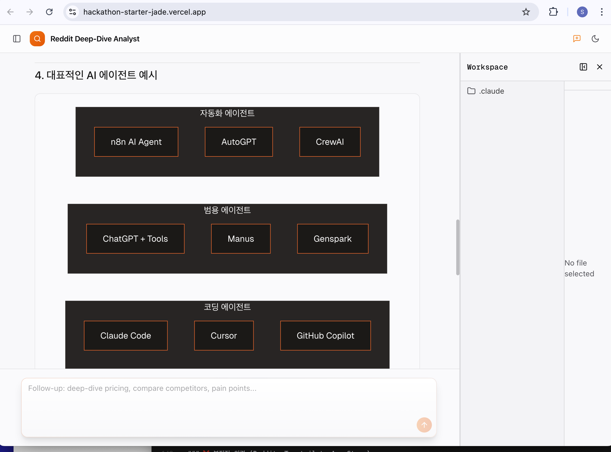

# Reddit Deep-Dive Analyst

<p align="center">
  
  
</p>

<p align="center">
  <strong>AI 에이전트가 Reddit을 자동 분석해서 AI 도구 시장 조사 리포트를 만들어주는 Agent</strong>
</p>

<p align="center">
  <strong><a href="#english">English</a></strong> | <strong>한국어</strong>
</p>

---

## 스크린샷

<p align="center">
  
</p>

| 리포트 분석 화면 | Mermaid 차트 | 플로우차트 다이어그램 |
|:---:|:---:|:---:|
|  |  |  |

---

## Motivation

AI 도구를 선택할 때 가장 솔직한 정보는 Reddit에 있습니다.
하지만 영어 Reddit 스레드를 수백 개씩 읽고 분석하는 건 비현실적이죠.

**Reddit Deep-Dive Analyst**는 키워드 하나만 입력하면, Claude 에이전트가 자율적으로 Reddit을 검색·분석해서 구조화된 리포트를 생성합니다.

```
"Cursor vs Claude Code" 입력 → 5분 뒤 → 완성된 시장 조사 리포트 + PDF 다운로드
```

---

## 주요 기능

| 기능 | 설명 |
|------|------|
| **자율 Reddit 분석** | Claude 에이전트가 WebSearch/WebFetch로 Reddit 스레드를 자동 수집·분석 |
| **구조화된 리포트** | 개요, 성능, 가격, 커뮤니티 평가, 페인포인트를 체계적으로 정리 |
| **Mermaid 차트** | 감성 분석 파이차트, 기능 비교 바차트, 워크플로우 다이어그램 자동 생성 |
| **실시간 진행 상황** | 6단계 프로세싱 스텝이 에이전트 작업 현황을 실시간 표시 |
| **리포트 다운로드** | PDF (전체), 1페이지 요약 PDF, Markdown 3가지 형식 지원 |
| **대화 히스토리** | Supabase DB에 대화 기록 저장, 사이드바에서 이전 분석 조회 |
| **다크/라이트 모드** | 오렌지 테마 기반 다크·라이트 모드 전환 |
| **다국어 지원** | 한국어로 질문하면 한국어로, 영어로 질문하면 영어로 응답 |

---

## 기술 스택

```
Frontend:  Next.js 16 · React 19 · Tailwind CSS v4 · shadcn/ui
Backend:   Next.js API Routes · Prisma ORM · Supabase PostgreSQL
Agent:     Claude Agent SDK (@anthropic-ai/claude-agent-sdk)
Sandbox:   Moru Cloud (Firecracker microVM)
PDF:       jsPDF + html2canvas-pro
Charts:    Mermaid.js
Deploy:    Vercel
```

---

## 아키텍처

```
┌─────────────┐     POST /api/conversations     ┌──────────────┐
│             │ ──────────────────────────────▶  │              │
│   Next.js   │                                  │  Moru Cloud  │
│   Frontend  │  ◀── polling (2s) ──────────────│  Sandbox     │
│             │     GET /api/conversations/:id    │  (microVM)   │
└─────────────┘                                  └──────┬───────┘
       │                                                │
       │                                    Claude Agent SDK
       │                                    query() + WebSearch
       ▼                                                │
┌─────────────┐                                         ▼
│  Supabase   │                              ┌──────────────────┐
│  PostgreSQL │                              │  Reddit Threads  │
│  (Prisma)   │                              │  via WebSearch   │
└─────────────┘                              └──────────────────┘
```

**동작 흐름:**
1. 사용자가 AI 도구 키워드 입력 (예: "Cursor vs Claude Code")
2. Next.js API가 Moru 샌드박스에 Claude 에이전트 실행
3. 에이전트가 자율적으로 Reddit 검색 → 스레드 분석 → 리포트 작성 (최대 50턴)
4. 프론트엔드가 2초 간격으로 폴링하며 실시간 메시지 표시
5. 완료 시 리포트 다운로드 팝업 표시

---

## Seoul AI Builders Hackathon

이 프로젝트는 [Seoul AI Builders](https://discord.gg/g5M7rqfEPY) Claude Agent SDK 해커톤에서 만들었습니다.

**Built with:**
- [Claude Agent SDK](https://platform.claude.com/docs/en/agent-sdk/overview) — AI 에이전트 프레임워크
- [Moru](https://moru.io) — 클라우드 샌드박스 (Firecracker microVM)
- [hackathon-starter](https://github.com/moru-ai/hackathon-starter) — 스타터 레포 기반

---

## License

MIT

---

<a name="english"></a>

## English

### What is this?

**Reddit Deep-Dive Analyst** is a web app where a Claude AI agent autonomously searches and analyzes Reddit to generate structured market research reports on AI tools.

Instead of manually reading hundreds of English Reddit threads, just type a keyword like `"Cursor vs Claude Code"` and get a comprehensive report with sentiment analysis charts, feature comparisons, pricing breakdowns, and pain point mapping — in about 5 minutes.

### Key Features

- **Autonomous Reddit Research** — Claude agent uses WebSearch/WebFetch to crawl Reddit threads
- **Structured Reports** — Overview, performance, pricing, community feedback, pain points
- **Mermaid Charts** — Auto-generated pie charts, bar charts, and flow diagrams
- **Real-time Progress** — 6-step processing indicator showing agent's current task
- **Report Downloads** — Full PDF, 1-page summary PDF, and Markdown formats
- **Conversation History** — Past analyses saved in Supabase, accessible from sidebar
- **Dark/Light Mode** — Orange-themed UI with mode toggle
- **Multilingual** — Responds in the same language as the user's input

### Tech Stack

- **Frontend**: Next.js 16, React 19, Tailwind CSS v4, shadcn/ui
- **Backend**: Next.js API Routes, Prisma ORM, Supabase PostgreSQL
- **Agent**: Claude Agent SDK running in Moru Cloud Sandbox (Firecracker microVM)
- **PDF**: jsPDF + html2canvas-pro
- **Charts**: Mermaid.js
- **Deploy**: Vercel


See the Korean section above for detailed setup instructions.
